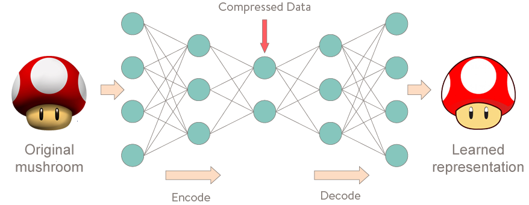
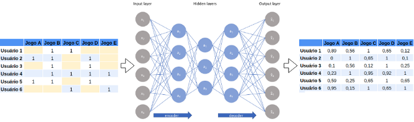
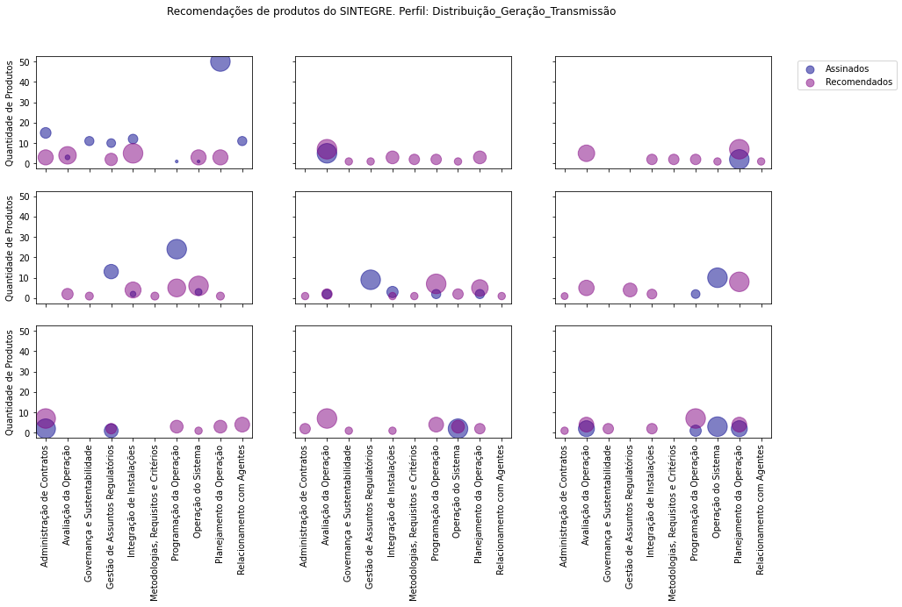

# Sistema de Recomendação de Conteúdo para o Portal SINTEGRE - ONS

#### Alunos: [Elvis Galiza](https://github.com/egaliza), [Ederson Albino](https://github.com/esousaa) 

#### Orientadora: [Manoela Kohler](https://github.com/manoelakohler) 

Trabalho apresentado ao curso [BI MASTER](https://ica.puc-rio.ai/bi-master) como pré-requisito para conclusão de curso e obtenção de crédito na disciplina "Projetos de Sistemas Inteligentes de Apoio à Decisão".

- [Treino_RecSys_Elvis_Ederson.ipynb](Treino_RecSys_Elvis_Ederson.ipynb). 

---

### Resumo

Este trabalho consiste na elaboração de uma prova de conceito (*POC*) de uma rede neural para uma tarefa de aprendizado profundo (*DL*) para um sistema que recomende produtos disponíveis no Portal SINTEGRE, elaborados pelo Operador Nacional do Sistema Elétrico - ONS, para usuários internos e externos à organização. 
O objetivo da POC é verificar a viabilidade de uma solução deste nível, avaliando as técnicas, modelos e algoritmos que melhor atendam aos requisitos e dados do SINTEGRE.

### <a lang="en">Abstract </a>

<a lang="en">
This work consists in the elaboration of a proof of concept <i>(POC)</i> of a neural network for a deep learning task <i>(DL)</i> for a system that recommends products available on the SINTEGRE Portal, prepared by the National Electric System Operator - ONS, for internal users and external to the organization.
The purpose of POC is to verify the feasibility of a solution at this level, evaluating the techniques, models and algorithms that best meet the requirements and data of SINTEGRE.
</a>

### 1. Introdução

O **SINTEGRE** é um portal, do ONS, que disponibiliza informações do setor elétrico elaborados pelo Operador, no qual denominamos de produtos, para diferentes nichos de usuários, cada qual com interesses específicos. Dentre desses grupos, podemos destacar:
*   Colaboradores do ONS
*   Agentes do Setor Elétrico
*   Empresas ligadas ou não ao Setor Elétrico
*   Pessoas físicas ou jurídicas
*   Centros de Pesquisas
*   Universidades
*   Jornalistas
*   Estudantes

Um sistema de recomendações pode ser útil para o ONS, pois ele pode alavancar o consumo de produtos no portal do SINTEGRE. Ou seja, o objetivo em adotar esta solução é aumentar o consumo destes produtos. Este aumento deverá ser possível através da geração de recomendações personalizadas, que considerem as preferências dos usuários e as características dos produtos.

Atualmente, o portal do SINTEGRE não possui uma maneira eficaz de recomendar produtos aos usuários no portal e não possui, também, um mecanismo de divulgação personalizada para seus produtos. Deste modo, o portal poderia se beneficiar com os seguintes recursos:
*   Recomendar produtos para usuários cujo conteúdo seja mais relevante ao seu perfil;
*   Permitir aos usuários ampliar o conhecimento sobre os produtos do portal;
*   Ampliar o uso do portal com o aumento do consumo de mais produtos oferecidos pelo SINTEGRE;
*   Ampliar o número de usuários no SINTEGRE cativando-os com recomendações de produtos mais aderentes e personalizados;
*   Gerar lista de possíveis novos consumidores para determinados produtos.

### 2. Modelagem

#### 2.1 O que é um Sistema de Recomendações
Um Sistema de recomendação pode ser definido como sendo uma ferramenta que utiliza uma série de algoritmos, análises de dados e conceitos de inteligência artificial para fornecer sugestões de itens a serem recomendados para um usuário. As sugestões fornecidas visam ajudar os usuários em vários processos de tomada de decisão, como por exemplo, quais itens comprar, quais música escutar ou quais notícias ler. Os sistemas de recomendação são valiosos, pois ajudam os usuários a lidarem com a sobrecarga de informações, filtrando-as e recomendando apenas aquelas que seriam, realmente, importantes para os usuários.

Um sistema de recomendação está relacionado a questões sociais, ele se preocupa com a extração de informações sobre as preferências e escolhas das pessoas, do que as pessoas gostam e do que não gostam. Um sistema de recomendação utiliza os dados que são fornecidos nessas escolhas, nessas curtidas, através de navegação na web e em apps. 

Os dados referentes aos usuários podem ser de dois tipos: explícitos ou implícitos. Os explícitos consistem em informação concedida pelos usuários, geralmente diante de alguma pergunta ou solicitação, como comentários e avaliações. Já os implícitos são produzidos de forma espontânea pelos usuários e têm a ver com o comportamento dele durante a navegação, como cliques que faz, buscas, tempo de permanência em alguma página etc. 

Atualmente, os sistemas de recomendação estão presentes na maioria dos serviços de streaming, nas redes sociais, comércio eletrônico e até em lojas de aplicativos que utilizamos no dia a dia. 

#### 2.2 O que é uma RN Autoencoder

Os Autoencoders são uma técnica de aprendizado não supervisionado, na qual usamos as redes neurais para a tarefa de aprendizado de representação. Especificamente, projetaremos uma arquitetura de rede neural de modo a impor um gargalo na rede que força uma representação de conhecimento compactada da entrada original. Se os recursos de entrada fossem independentes um do outro, essa compressão e reconstrução subsequente seriam uma tarefa muito difícil. No entanto, se houver algum tipo de estrutura nos dados (ou seja, correlações entre os recursos de entrada), essa estrutura poderá ser aprendida e consequentemente aproveitada ao forçar a entrada através do gargalo da rede.

Autoencoders (AE) são redes neurais que visam copiar suas entradas para suas saídas. Eles trabalham compactando a entrada em uma representação de espaço latente e, em seguida, reconstruindo a saída dessa representação. Esse tipo de rede é composto de duas partes:

Codificador (Encoder): é a parte da rede que compacta a entrada em uma representação de espaço latente (codificando a entrada). Pode ser representado por uma função de codificação h = f (x).

Decodificador (Decoder): Esta parte tem como objetivo reconstruir a entrada da representação do espaço latente. Pode ser representado por uma função de decodificação r = g (h).

Com essas caraterísticas, as RNs Autoencoders são usadas em sistemas de recomendação para filtragem colaborativa, onde o usuário interage com o conteúdo. No nosso caso, temos a relação em uma matriz de quais produtos (colunas) foram assinados por cada usuário (linha). Representado por 0 (não assinado) e 1(assinado).
A partir desta matriz usuário x produto, podemos de fato comprimí-la por ser esparsa e depois reconstruir uma versão completa da matriz contendo uma aproximação de todos os valores que antes eram nulos. Algo como:

Ao final, basta apenas ordenar as recomendações por usuário, selecionando aquelas de maior pontuação.

### 3. Resultados

Para melhor representar o resultado final da POC, executamos o modelo para todos os usuários da base de teste.
Agrupando-os em perfis que estabelecemos mediante a análise de suas características e agrupando os produtos conforme os processos técnicos (negócio) que os mesmos são gerados.

O gráfico acima exibe 9 usuários selecionados aleatoriamente da base de teste para um deteminado perfil.
Onde os círculos azuis demonstram a quantidade de produtos que cada usuário assinou (dados de entrada) e os círculos roxos exibem a quantidade de produtos recomendados pelo modelo de previsão por processo técnico (dados de saída).

### 4. Conclusões

O modelo de rede neural implementado na POC demonstra que é viável a utilização de um sistema de recomendação para sugerir produtos aos usuários do portal SINTEGRE do ONS.

Para tornar esta solução mais robusta tecnicamente e com isso evoluir no atendimento às necessidades da área de negócio, identificou-se pontos de melhorias a serem implantados no próprio portal com o objetivo de amplificar a base de dados e com isso melhorar as informações que alimentam o modelo de aprendizado profundo utilizado, conseguindo assim ter recomendações mais assertivas.
Sugerimos ações como:
* Implementar um processo de auditoria na navegação pelo portal, para coleta de dados de menira implícita
* Fazer recomendações utilizando as avaliações de produtos realizadas por usuários 
* Considerar os produtos favoritados por usuários para gerar novas recomendações
* Criar listas de usuários para campanhas de divulgação de produtos

---

Matrícula: 192.671.183 - Elvis Galiza\
		   202.100.139 - Ederson Albino

Pontifícia Universidade Católica do Rio de Janeiro

Curso de Pós Graduação <b lang="en">Business Intelligence Master</b>
